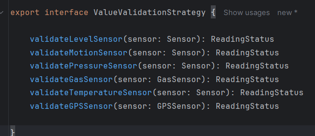
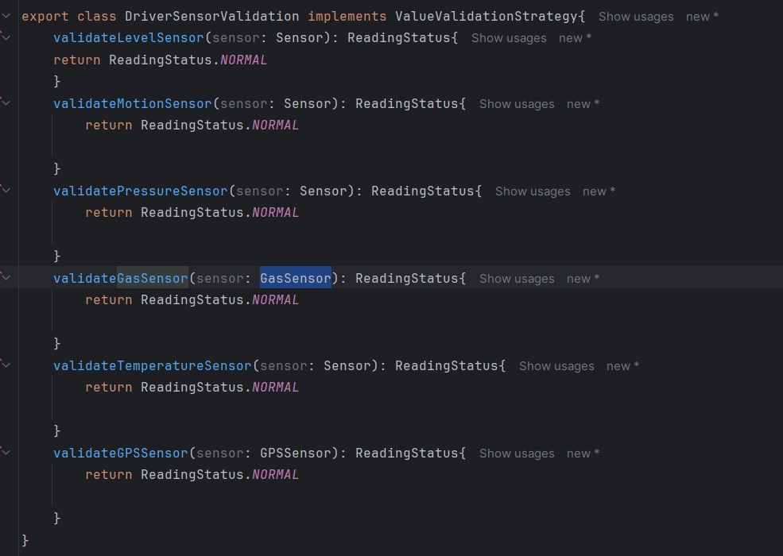
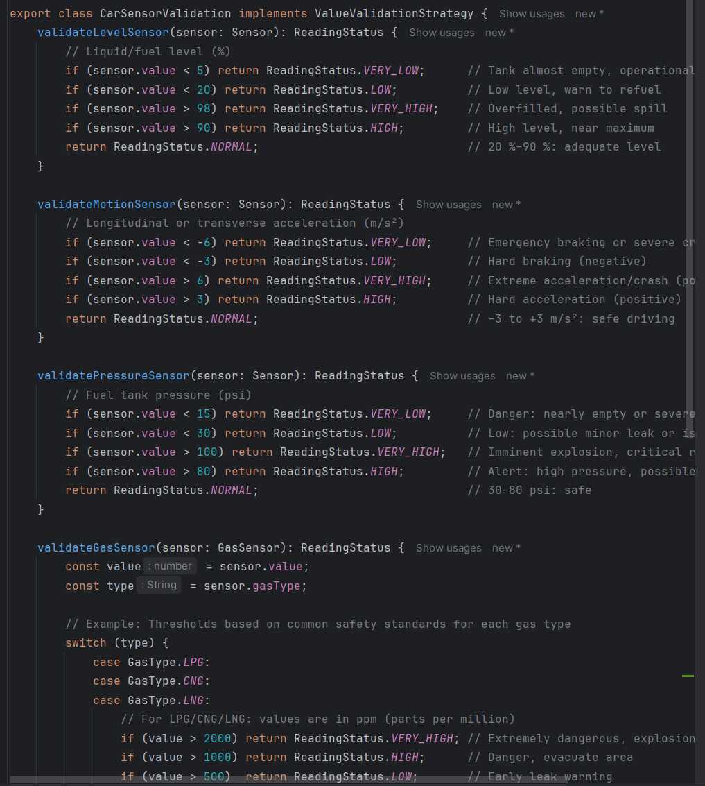
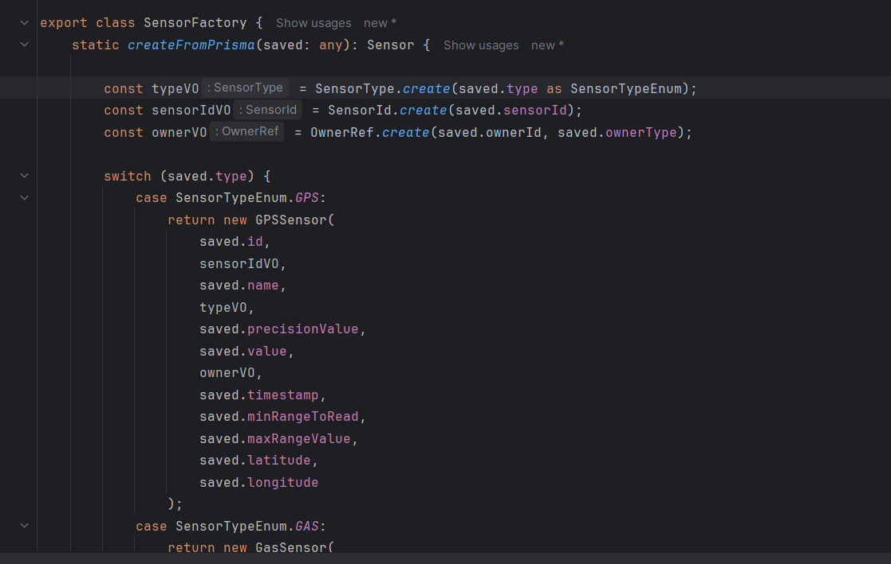
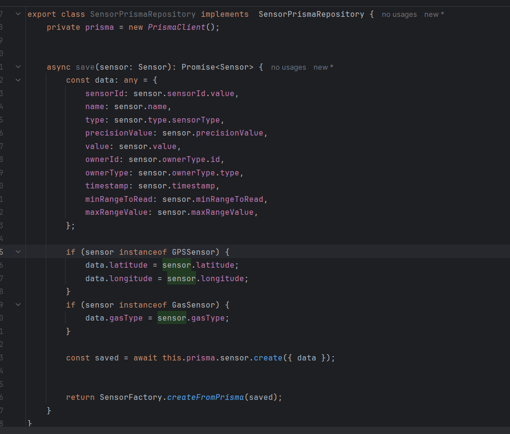

### Patterns used in this project

**Strategy Pattern**

- Instead of hard-coding validation logic within each sensor entity using large if-else or switch statements, I designed a flexible system where each sensor delegates the validation process to a context-specific strategy class. For example, a LevelSensor determines its status (such as NORMAL, HIGH, or LOW) by invoking a validation strategy based on its owner type (Car, Driver, etc.).

- This approach enables clear separation of concerns and makes it easy to introduce new validation rules or support additional sensor owner types without changing the core business logic. Each strategy encapsulates its own validation thresholds and logic, allowing us to adhere to the Open/Closed Principle and making the codebase easier to maintain and extend.

- By injecting the validation strategy rather than instantiating it within the entity, the system is further decoupled and highly testable.

  
  
  

**Factory Pattern**

- In the repository, I implemented the Factory pattern for reconstructing domain entities from data persisted in the database.
Using the Factory pattern centralizes the instantiation logic based on the sensor type, ensuring that each domain object is constructed correctly, respecting the invariants and specificities of each subtype.
This separates the persistence logic from the domain construction logic, facilitating the maintainability and extension of the system to new types of sensors.

  
  

